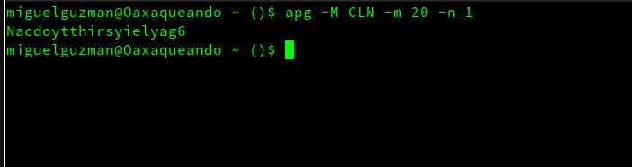

# Optimización del Kernel Linux

Aquí está la arquitectura general del stack TCP/IP:



Para aplicar la configuración ejecuta el siguiente comando: 
Comando:

```bash
# test
ls -la /home
```

<div class="author-card">
  <div class="author-card-header">
    <div class="author-avatar">
      
    </div>
    
    <div class="author-info">
      <span class="author-label">El autor</span>
      <h4 class="author-name">Miguel Guzmán</h4>
    </div>

    <div class="author-google-link">
      <a class="google-preferred-source" href="https://www.google.com/preferences/source?q=migue-linux.com" target="_blank" rel="noopener">
        <svg class="google-icon" viewBox="0 0 48 48" aria-hidden="true">
          <path fill="#EA4335" d="M24 9.5c3.54 0 6.71 1.22 9.21 3.6l6.85-6.85C35.9 2.38 30.47 0 24 0 14.62 0 6.51 5.38 2.56 13.22l7.98 6.19C12.43 13.72 17.74 9.5 24 9.5z"></path>
          <path fill="#4285F4" d="M46.98 24.55c0-1.57-.15-3.09-.38-4.55H24v9.02h12.94c-.58 2.96-2.26 5.48-4.78 7.18l7.73 6c4.51-4.18 7.09-10.36 7.09-17.65z"></path>
          <path fill="#FBBC05" d="M10.53 28.59c-.48-1.45-.76-2.99-.76-4.59s.27-3.14.76-4.59l-7.98-6.19C.92 16.46 0 20.12 0 24s.92 7.54 2.56 10.78l7.97-6.19z"></path>
          <path fill="#34A853" d="M24 48c6.48 0 11.93-2.13 15.89-5.81l-7.73-6c-2.15 1.45-4.92 2.3-8.16 2.3-6.26 0-11.57-4.22-13.47-9.91l-7.98 6.19C6.51 42.62 14.62 48 24 48z"></path>
        </svg>
        <span>Agregar migue-linux.com como fuente preferida en Google</span>
      </a>
    </div>
  </div>

  <div class="author-bio">
    <p>
      SysAdmin, apasionado por la optimización de servidores Linux, desarrollo web y automatización. Compartiendo bitácoras de infraestructura y proyectos de software libre.
    </p>
  </div>

  <div class="author-footer">
    <a href="?page=about" class="more-from-author">Más sobre Miguel &rarr;</a>
  </div>
</div>
